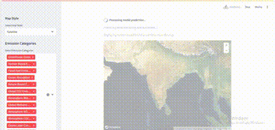

# PrithviAI

PrithviAI is an advanced AI-powered platform designed to provide insights into global climate change by analyzing various emissions data, such as CO2, methane, and other pollutants. Using auto-selection AI models and interactive maps, this platform helps visualize and predict the impact of emissions on different regions across the globe.

## Features

1. **Auto-Selection AI Model System**  
   Our platform is built with an intelligent auto-selection system that dynamically chooses the right AI model based on the selected emission type (CO2, methane, etc.). This feature allows users to focus on inputting data and viewing results without manually selecting models.

2. **Interactive Visualization with Streamlit**  
   PrithviAI offers interactive map visualizations where users can view the intensity of various emissions across global locations. Built using Python and Streamlit, the platform allows users to toggle between grid and scatterplot views, ensuring an intuitive experience when analyzing data.

3. **Seamless Frontend Integration**  
   The project’s website frontend is developed using Next.js and Tailwind CSS. It provides a modern, responsive interface with dark mode, highlighting data in a visually engaging way. The website is hosted on Vercel, ensuring fast and reliable deployment.

## Project Workflow

### Backend Architecture
Our backend, powered by Python and TensorFlow, processes emissions data from various sources such as CO2 and methane emission datasets. Using AI models, the platform can predict the spread and intensity of emissions across different regions.

The AI models are trained to automatically switch between datasets based on the type of emission being processed, providing an optimized workflow. The core backend relies on:
- **Python** for data handling and AI processing
- **TensorFlow** for model training and prediction
- **Streamlit** for building the user-facing interface
- **Geospatial libraries** (rasterio, pydeck) for map rendering and data visualization.

### Frontend Architecture
The frontend uses:
- **Next.js**: A React-based framework for building user interfaces.
- **Tailwind CSS**: For responsive and modern design.
- **D3.js**: For handling advanced data visualizations on interactive maps.
- **Vercel**: For hosting the frontend with high performance and scalability.

### Installation Guide

#### Backend
1. Clone the repository:
   ```bash
   git clone https://github.com/cyberkutti-iedc/PrithviAI.git
   ```
2. Navigate to the project directory:
   ```bash
   cd PrithviAI
   ```
3. Install the required dependencies:
   ```bash
   pip install -r requirements.txt
   ```
4. Run the Streamlit app:
   ```bash
   streamlit run app.py
   ```

#### Frontend
1. Navigate to the `frontend` directory:
   ```bash
   cd frontend
   ```
2. Install the dependencies:
   ```bash
   npm install
   ```
3. Start the development server:
   ```bash
   npm run dev
   ```
4. The frontend will be available at `http://localhost:3000`.

## Video Overview

Here is an animation of PrithviAI in action:  



### AI Model Training
The AI models are trained using historical emissions data collected from global sources, such as Earth.gov. The system allows for retraining the models as new data becomes available, ensuring continuous improvement in prediction accuracy.

### Auto Gear System
Our auto-selection gear system intelligently chooses the correct AI model based on user input data. This reduces complexity for users and ensures that the right models are used for accurate predictions.

### Data Sources
PrithviAI aggregates emissions data from reliable sources such as Earth.gov. The data is processed to ensure it aligns with the specific needs of our AI models for CO2, methane, and other emissions.


## Future Enhancements
1. **Advanced Data Visualization**: Introducing more advanced D3.js visualizations for emissions and climate change effects.
2. **Predictive Analytics**: Expanding AI models to predict future climate trends beyond emissions.
3. **Global Expansion**: Integrating more data sources to provide global coverage of climate data.

## Contact Us
For inquiries or collaborations, please reach out to us at ecoceeteam@gmail.com.
